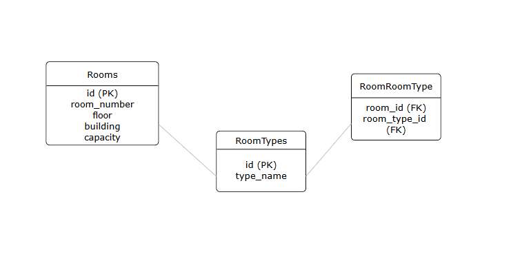

# Вариант № 17. Room Service (Сервис аудиторий)

## 1. Создание типа аудитории (create)

### Параметры для создания

| Параметр   | Пояснение                | Обязательность | Тип   | Ограничение                          | Значение по умолчанию |
|------------|--------------------------|----------------|--------|--------------------------------------|----------------------|
| type_name  | Название типа аудитории  | Да             | str    | Уникальное значение, min length 1, max length 50 | -                    |

### Информация после успешного создания

| Параметр   | Тип   |
|------------|--------|
| id         | int    |
| type_name  | str    |

---

## 2. Изменение типа аудитории по ID (change)

### Параметры для изменения

| Параметр   | Пояснение           | Обязательность | Тип   | Ограничение                          | Значение по умолчанию |
|------------|---------------------|----------------|--------|--------------------------------------|----------------------|
| type_name  | Новое название типа  | Нет            | str    | Уникальное значение, min length 1, max length 50 | -                    |

### Информация после успешного изменения

| Параметр   | Тип   |
|------------|--------|
| id         | int    |
| type_name  | str    |

---

## 3. Удаление типа аудитории по ID (delete)

* Возвращает **True**, если тип аудитории был удален
* Возвращает **False** в противном случае

---

## 4. Получение типа аудитории по ID (get)

### Информация после успешного поиска

| Параметр   | Пояснение           | Тип   |
|------------|---------------------|--------|
| id         | ID типа аудитории   | int    |
| type_name  | Название типа       | str    |

---

## 5. Получение списка типов аудитории (get list)

### Параметры для поиска

| Параметр   | Пояснение                  | Тип   |
|------------|----------------------------|--------|
| type_name  | Частичное совпадение названия | str    |
| limit      | Лимит количества записей    | int    |

### Информация после успешного поиска

| Параметр   | Тип   |
|------------|--------|
| id         | int    |
| type_name  | str    |

---

## 6. Создание аудитории (create)

### Параметры для создания

| Параметр   | Пояснение               | Обязательность | Тип   | Ограничение                  | Значение по умолчанию |
|------------|-------------------------|----------------|--------|------------------------------|----------------------|
| room_number| Номер аудитории         | Да             | str    | -                            | Уникальное значение в комбинации с building |
| floor      | Этаж                   | Да             | int    | ≥ 1                          | -                    |
| building   | Корпус                  | Да             | str    | -                            | -                    |
| capacity   | Вместимость             | Да             | int    | > 0                          | -                    |
| type_ids   | Список ID типов         | Нет            | array of int | -                            | []                   |

### Информация после успешного создания

| Параметр   | Пояснение               | Тип   |
|------------|-------------------------|--------|
| id         | ID аудитории            | int    |
| room_number| Номер аудитории         | str    |
| floor      | Этаж                   | int    |
| building   | Корпус                  | str    |
| capacity   | Вместимость             | int    |
| is_active  | Статус активности       | boolean|
| types      | Типы аудитории          | array of RoomTypeResponse |

---

## 7. Изменение аудитории по ID (change)

### Параметры для изменения

| Параметр   | Пояснение               | Обязательность | Тип   | Ограничение                  | Значение по умолчанию |
|------------|-------------------------|----------------|--------|------------------------------|----------------------|
| room_number| Новый номер аудитории   | Нет            | str    | -                            | Если указан, должен быть уникальным в комбинации с building |
| floor      | Новый этаж             | Нет            | int    | ≥ 1                          | -                    |
| building   | Новый корпус           | Нет            | str    | -                            | -                    |
| capacity   | Новая вместимость       | Нет            | int    | > 0                          | -                    |
| type_ids   | Новые ID типов         | Нет            | array of

